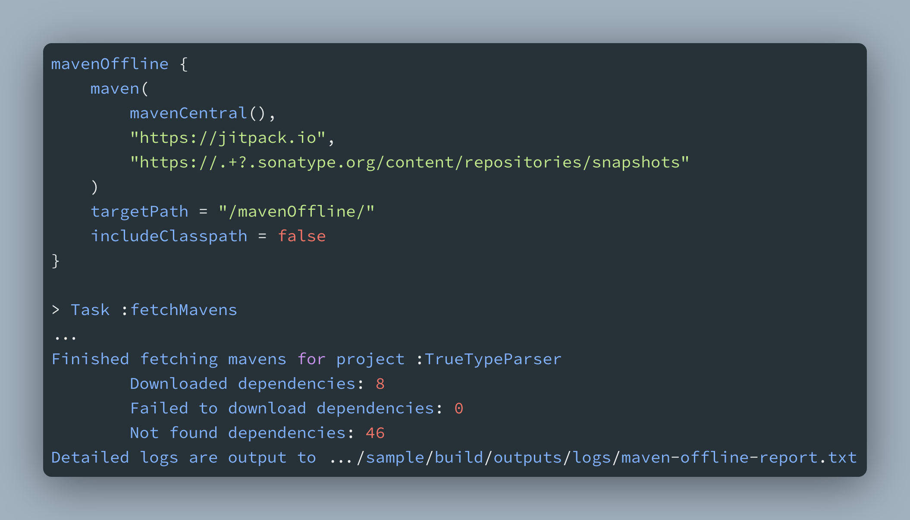

# Maven Offline

[](https://search.maven.org/artifact/io.github.yubyf.mavenoffline/maven-offline-gradle-plugin)

[](https://github.com/Yubyf/maven-offline-gradle-plugin/blob/master/LICENSE)


Gradle plugin for fetching specific maven repositories to local.



## Installation

**Maven Offline Gradle Plugin** is available on
both [Gradle Plugin Portal](https://plugins.gradle.org/plugin/io.github.yubyf.maven-offline)(Pending Approval)
and [MavenCentral](https://search.maven.org/artifact/io.github.yubyf.mavenoffline/maven-offline-gradle-plugin)

1\. Add the `mavenCentral()` or `gradlePluginPortal()` to your top-level

`settings.gradle`:

```groovy
pluginManagement {
    repositories {
        mavenCentral()
        // or
        gradlePluginPortal()
    }
}
```

or `build.gradle`(legacy):

```groovy
buildscript {
    repositories {
        mavenCentral()
        // or
        gradlePluginPortal()
    }
}
```

2\. Apply the plugin to your root project(recommend) or sub-projects.

<details open><summary>Kotlin DSL</summary>

```Kotlin
// build.gradle.kts
plugins {
    id("io.github.yubyf.maven-offline").version("$latest_version")
}
```

</details>

<details close><summary>Groovy</summary>

```groovy
// build.gradle
plugins {
    id 'io.github.yubyf.maven-offline' version '${latest_version}'
}
```

</details>

<details close><summary>Legacy Groovy</summary>

```groovy
// build.gradle
buildscript {
    ...
    dependencies {
        ...
        classpath 'io.github.yubyf.mavenoffline:maven-offline-gradle-plugin:${latest_version}'
    }
}
apply plugin: "io.github.yubyf.maven-offline"
```

</details>

**NOTE**: If you apply the plugin to the root project, it is automatically applied to **ALL** subprojects. You can apply
the plugin to a specific subproject **WITHOUT** applying it to the root project to make it only work in that project.

## Usage

### Configuration

You can configure plugin in `build.gradle` where it is already applied.

The plugin lets you define repository URLs you want to fetch dependencies, the target path to store the fetched
repositories, and whether the `classpath` declared dependencies should be included:

```Kotlin
mavenOffline {
    maven(
        // Repository URLs, plugin provides default URLs for
        // Maven Central, Google, and jcenter(not recommended)
        // Default: empty
        mavenCentral(),
        google(),
        jcenter(),
        // Add your custom repository URLs here
        "https://jitpack.io"
    )

    // Target path to store the fetched repositories
    // Relative to the project or sub-project root directory
    // Default full path: "$rootDir/maven-offline/"
    targetPath = "/mavenOffline/"

    // Whether to include the `classpath` declared dependencies
    //   such as the declared `classpath 'com.android.tools.build:gradle:x.y.z'`
    //   in the `buildscript>dependencies` block of `build.gradle`
    // Default: false, recommended to set to false
    includeClasspath = false
}
```

The plugin configuration syntax is the same in `Kotlin DSL` and `Groovy`.

**NOTE**: If the plugin is applied to the root project, the plugin configuration will override configurations in all
sub-projects.

### Task

The plugin provides a `fetchMavens` task to fetch dependencies. After Gradle sync is complete, the task will be
available in the Gradle tasks list.

You can run the task through the Gradle console:

```shell
// root project
gradlew fetchMavens
// sub-project
gradlew :${sub_project_name}:fetchMavens
```

The task will fetch all dependencies in repositories declared in the plugin configuration and store them in the target
path.

The abbreviated result will be output to the console：

```console
> Task :fetchMavens
Extracting artifacts for project :sample...
Found 64 dependencies in project :sample
Download directory of project :sample: .../sample/maven-offline/
Extracting effective repositories for project :sample...
Effective repositories of project :sample - MavenRepo
Start fetching mavens for project :sample...
Main files of [org.jetbrains:annotations:13.0] fetched successfully
Main files of [org.jetbrains.kotlin:kotlin-stdlib-jdk7:1.6.10] fetched successfully
...
Finished fetching mavens for project :TrueTypeParser
        Downloaded dependencies: 0
        Failed to download dependencies: 0
        Not found dependencies: 0
Detailed logs are output to .../sample/build/outputs/logs/maven-offline-sample-report.txt
```

You can view the detailed logs by clicking the file link at the end of the task output in the console.

## License

    Copyright (c) 2022 Alex Liu

    Licensed under the Apache License, Version 2.0 (the "License");
    you may not use this file except in compliance with the License.
    You may obtain a copy of the License at

       http://www.apache.org/licenses/LICENSE-2.0

    Unless required by applicable law or agreed to in writing, software
    distributed under the License is distributed on an "AS IS" BASIS,
    WITHOUT WARRANTIES OR CONDITIONS OF ANY KIND, either express or implied.
    See the License for the specific language governing permissions and
    limitations under the License.
